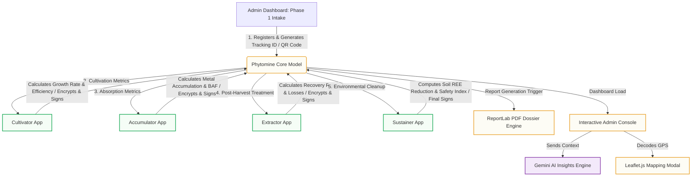

# Phytomine

[](https://www.python.org/)
[](https://www.djangoproject.com/)
[](https://ai.google.dev/)
[](#license)

**Phytomine** is a state-of-the-art, Django-based enterprise platform designed for monitoring, validating, and managing a multi-stage post-harvest extraction pipeline of Rare Earth Elements (REE) and heavy metals using hyper-accumulator plants (e.g., ferns). 

The platform integrates Generative AI diagnostics, end-to-end cryptographic traceability, real-time spatial geocoding, and an interactive intelligent assistant chatbot into a single, cohesive workflow.

---

## System Architecture



---

## Core Capabilities & Features

### 1. Multi-Stage Modular Pipeline
The core pipeline is divided into five dedicated Django apps matching real-world organizational roles:
*   **Admins (Central Operations):** Creates new projects (Phase 1), initiates tracking, manages registrations, generates physical QR codes, performs manual Phase 2 overrides, and generates official PDF dossiers.
*   **Cultivator:** Processes initial and final biomass values to measure growth rate (g/day), growth efficiency (%), and biomass increase.
*   **Accumulator:** Processes REE plant concentrations and soil content to evaluate overall Bioaccumulation Factor (BAF), total metal absorption, and uptake percentages.
*   **Extractor:** Calculates technical extraction recovery percentages, loss metrics, and final recovered metals.
*   **Sustainer:** Oversees environmental restoration, verifying soil REE reduction, calculating safety indices, and assigning ecological status flags.

### 2. Generative AI Expert Diagnostics
*   **Gemini Integration:** Seamlessly connects to the Google Gemini API (`gemini-3-flash-preview` / `gemini-3-flash`) through the `google-genai` SDK.
*   **Contextual Analytics:** Evaluates project parameters (e.g., location, soil morphology, extraction efficiency) in real time to generate formatted JSON suggestions, including recommended alternative hyper-accumulator crops, progression estimates, and safety considerations.

### 3. End-to-End Cryptographic Privacy & Signatures
*   **Fernet Encryption:** Sensitive agricultural and REE data (e.g., biomass figures, metal weights, chemical concentrations) are encrypted symmetrically using Python's `cryptography` library before being stored in the database.
*   **Cryptographic Approvals:** Each module requires role-specific keys to decrypt, modify, and sign off on data. The database logs the specific personnel signature (`cul_signed_by`, `acc_signed_by`, etc.) to enforce total auditability.

### 4. Interactive Spatial Geocoding
*   **Leaflet.js & OpenStreetMap:** The admin dashboard features an interactive spatial geolocator modal.
*   **Geocoding Proxy:** Integrates with the Nominatim OpenStreetMap API, resolving browser-supplied GPS coordinates to full, human-readable locations in the project metadata.

### 5. Intelligent Assistant Chatbot Widget
*   **Command Interface:** Features a custom, responsive glassmorphism chatbot widget that supports markdown parsing via `Marked.js`.
*   **Direct Database Querying:** Allows admins to run text commands or use quick-action buttons to instantly retrieve:
    *   *Pending Approvals:* A breakdown of user requests pending validation per department.
    *   *Project Progress:* Real-time workflow verification status for any project.
    *   *PDF Dossiers:* Instant download links for generated project reports.
    *   *Recent Logins & Users Directory:* Quick views of system logs and approved staff listings.

---

## Technical Stack

*   **Backend:** Python 3.10+, Django 5.2+, Gunicorn
*   **Database:** MySQL / SQLite
*   **Machine Learning / AI:** Google GenAI SDK
*   **Cryptography:** Python `cryptography` (Fernet implementation)
*   **Document Generation:** ReportLab (SimpleDocTemplate, Paragraph, Table, TableStyle)
*   **Frontend UI:** Vanilla CSS (Glassmorphism design tokens), Bootstrap 5, FontAwesome 7, Leaflet.js mapping, Marked.js (Markdown parser)
*   **Deployment:** Docker, Docker Compose

---

## Installation & Local Setup

### Prerequisites
Make sure you have the following installed on your machine:
*   [Python 3.10+](https://www.python.org/downloads/)
*   [MySQL Server](https://dev.mysql.com/downloads/installer/) (if running in production configuration)
*   [Docker Desktop](https://www.docker.com/products/docker-desktop/) (optional, for containerized deployments)

### 1. Clone the Workspace
```bash
git clone <repository_url>
cd Phytomine
```

### 2. Configure the Virtual Environment
Create and activate a virtual environment to isolate project dependencies:
```bash
# Windows
python -m venv venv
venv\Scripts\activate

# macOS / Linux
python3 -m venv venv
source venv/bin/activate
```

### 3. Install Dependencies
```bash
pip install -r requirements.txt
```
*Note: If `requirements.txt` is empty, install core dependencies manually:*
```bash
pip install django reportlab cryptography requests google-genai qrcode gunicorn mysqlclient
```

### 4. Set Up Environment Variables
Create a `.env` file in the root directory and configure it as follows:
```env
SECRET_KEY=your-django-secret-key
DEBUG=True
ALLOWED_HOSTS=*

# Google GenAI Credentials
GEMINI_API_KEY=your_gemini_api_key_here

# Database Configuration (Defaults to SQLite if fields are unused)
DB_NAME=phytomine
DB_USER=root
DB_PASSWORD=your_mysql_password
DB_HOST=127.0.0.1
DB_PORT=3306

# Email Settings for Admin Approvals
EMAIL_HOST=smtp.gmail.com
EMAIL_PORT=587
EMAIL_USE_TLS=True
EMAIL_HOST_USER=your_email@gmail.com
EMAIL_HOST_PASSWORD=your_app_password
```

### 5. Apply Migrations & Setup Database
Run the following commands to initialize the schema:
```bash
python manage.py makemigrations
python manage.py migrate
```

### 6. Generate Phase Two Templates
Compile the Phase Two templates and include the updated layout components:
```bash
python make_phase_two.py
```

### 7. Create Admin Credentials
Create a superuser to access Django's default administrative panel:
```bash
python manage.py createsuperuser
```

### 8. Run Development Server
```bash
python manage.py runserver
```
Navigate to `http://127.0.0.1:8000/` in your browser.
*   **Admin Dashboard Email:** `admin@gmail.com`
*   **Admin Dashboard Password:** `admin`

---

## Running Automated Tests

Verify code changes and logical workflows using Django's built-in testing suite:
```bash
python manage.py test
```

---

## Containerized Deployment (Docker)

Deploy Phytomine in production configuration using Docker Compose:

1. Build and run the containers:
   ```bash
   docker-compose up --build -d
   ```
2. Verify that the server is up and listening on port `8000`:
   ```bash
   docker ps
   ```

---

## Security Guidelines

1.  **Keep Secret Keys Out of VCS:** Never commit your `.env` file or raw API keys to Git.
2.  **Turn Off Debug Mode:** Set `DEBUG=False` in your `.env` when deploying to production.
3.  **Rotate Symmetric Keys:** Maintain regular rotations of Fernet secret keys in production settings to safeguard existing database backups.

---

## License

This project is proprietary and confidential. Unauthorized copying, distribution, or modifications of this project via any medium are strictly prohibited.
